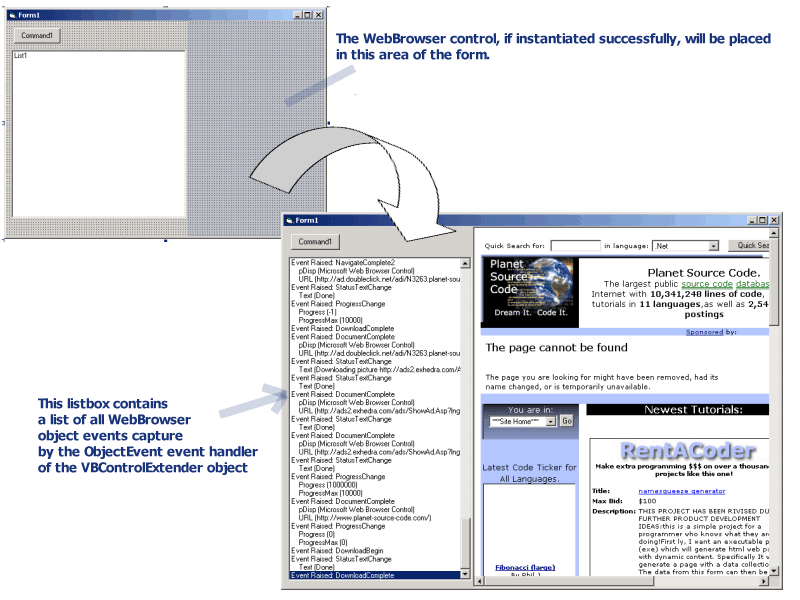



## Dynamically Add WebBrowser Control at runtime without a Reference \(V\. 2\)

### Description

Allows VB applications to determine at run-time if Internet Explorer (4.0 or later) is installed, and if so, creates a WebBrowser. If not, a trappable error allows program to continue. This is an enhanced version of a previous article, showing how to capture the events of the created object.
 
### More Info
 

             |
---                |---
**Submitted On**   |
**By**             |[Dave Slinn](https://github.com/Planet-Source-Code/PSCIndex/blob/master/ByAuthor/dave-slinn.md)
**Level**          |Beginner
**User Rating**    |5.0 (20 globes from 4 users)
**Compatibility**  |VB 6\.0
**Category**       |[Internet/ HTML](https://github.com/Planet-Source-Code/PSCIndex/blob/master/ByCategory/internet-html__1-34.md)
**World**          |[Visual Basic](https://github.com/Planet-Source-Code/PSCIndex/blob/master/ByWorld/visual-basic.md)
**Archive File**   |

### Source Code

On a VB6 Form, add a Button control in the upper
left corner and a Listbox control underneath the button and down the left hand
side of the form.&nbsp; Events raised by the WebBrowser will be displayed in the
listbox.

Place the following code into a standard VB 6.0 form.

Private WithEvents
m_WebControl As VBControlExtender

Private Sub Form_Resize() 
On Error Resume Next 
&nbsp;&nbsp; Me.List1.Height = Me.ScaleHeight - Me.List1.Top 
 
&nbsp;&nbsp; ' resize webbrowser to fill form next to listbox 
&nbsp;&nbsp; If Not m_WebControl
Is Nothing Then 
&nbsp;&nbsp;&nbsp;&nbsp; m_WebControl.Move Me.List1.Left + Me.List1.Width + 30, 0, ScaleWidth - (Me.List1.Left + Me.List1.Width + 30), ScaleHeight 
&nbsp;&nbsp; End If 
End Sub 
 
Private Sub Command1_Click() 
On Error GoTo ErrHandler 
 
&nbsp;&nbsp; ' attempting to add WebBrowser here ('Shell.Explorer.2' is registered 
&nbsp;&nbsp; ' with Windows if a recent (&gt;= 4.0) version of Internet Explorer is installed 
&nbsp;&nbsp; Set m_WebControl = Controls.Add(&quot;Shell.Explorer.2&quot;, &quot;webctl&quot;, Me) 
 
&nbsp;&nbsp; ' if we got to here, there was no problem creating the WebBrowser 
&nbsp;&nbsp; ' so we should size it properly and ensure it's visible 
&nbsp;&nbsp; m_WebControl.Move Me.List1.Left + Me.List1.Width + 30, 0, ScaleWidth - (Me.List1.Left + Me.List1.Width + 30), ScaleHeight 
&nbsp;&nbsp; m_WebControl.Visible = True 
 
&nbsp;&nbsp; ' use the Navigate method of the WebBrowser control to open a 
&nbsp;&nbsp; ' web page 
&nbsp;&nbsp; m_WebControl.object.navigate &quot;http://www.planet-source-code.com&quot; 
 
Exit Sub 
ErrHandler: 
&nbsp;&nbsp; MsgBox &quot;Could not create WebBrowser control&quot;, vbInformation 
End Sub 
 
Private Sub m_WebControl_ObjectEvent(Info
As EventInfo) 
On Error GoTo ErrHandler 
 
&nbsp;&nbsp; Dim i As Integer 
&nbsp;&nbsp; Dim evp As EventParameter 
 
&nbsp;&nbsp; ' display the event that was raised in the listbox 
&nbsp;&nbsp; Me.List1.AddItem &quot;Event Raised: &quot; &amp; Info.Name 
&nbsp;&nbsp; For Each evp In Info.EventParameters 
&nbsp;&nbsp; &nbsp;&nbsp; Me.List1.AddItem &quot; &quot; &amp; evp.Name &amp; &quot; (&quot; &amp; evp.Value &amp; &quot;)&quot; 
&nbsp;&nbsp; Next evp 
 
&nbsp;&nbsp; Me.List1.ListIndex = Me.List1.NewIndex 
Exit Sub 
ErrHandler: 
&nbsp;&nbsp; If Err.Number = -2147024809
Then 
&nbsp;&nbsp; &nbsp;&nbsp; Me.List1.AddItem &quot; &quot; &amp; evp.Name &amp; &quot; (#ERROR)&quot; 
&nbsp;&nbsp; &nbsp;&nbsp; Resume Next 
&nbsp;&nbsp; End If 
End Sub

